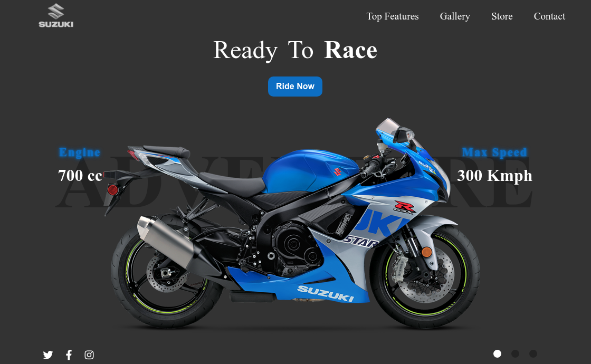

<h1 align="center">Landing Page</h1>

## Tabla de Contenidos

- [Vista General](#Vista-General)
- [Tecnologías Usadas](#tecnologias)
- [Características](#caracteristicas)
- [Contacto](#contacto)
- [Recursos](#recursos)

<!-- vista general -->
## Vista General
En este proyecto he realizado una Landing Page, como práctica para mejorar en el manejo de las tecnologías necesarias para realizar este proyecto.

## Tecnologías Usadas

- CSS3
- HTML5
- JavaScript

## Características

Landing Page con diseño resposivo para cualquier tamaño de pantalla.

## Recursos

- [W3Schools]( https://www.w3schools.com )
- [MDN]( https://developer.mozilla.org/es/ )

## Contacto

- GitHub [ @Pierre7Agus ]( https://github.com/Pierre7Agus )
- CodePen [ Pierre7Agus ]( https://codepen.io/pierre7agus/pens/public )
- Twitter [ @agurto_pierre ]( https://twitter.com/@agurto_pierre )

